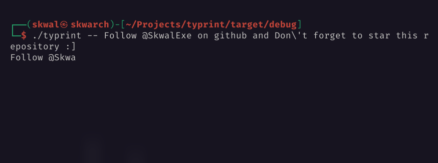
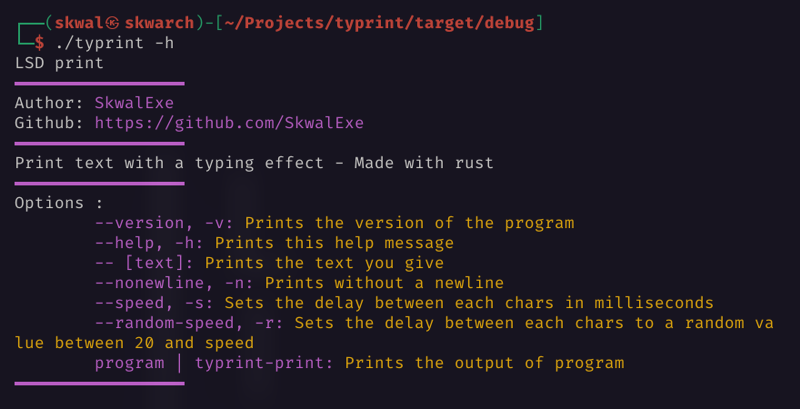

# typrint ⌨️



⌨️ Print text with a typing effect - Made with rust 🦀

# Installation 📦

## Arch Linux 🐧

typrint is in the AUR

```bash
yay -S typrint
```

## Other 🪟🐧

### With make - Linux 🐧

Run make

```bash
# 📂 typrint/
make
```

### Build from source - Linux 🐧 & Windows 🪟

**Clone this repo**

```bash
git clone https://github.com/SkwalExe/typrint.git
```

build with [cargo](https://doc.rust-lang.org/cargo/getting-started/installation.html)

```bash
# 📂 typrint/
cargo build --release
```

**[ LINUX ONLY ] :** Move the binary

```bash
# 📂 typrint/
sudo cp target/release/typrint /usr/bin/typrint
```

**On windows** the executable will be `target\release\typrint.exe` you can move it wherever you want.

# Usage 📝



# Docker 🐳

### Build 🛠️

```bash
# 📂 typrint/
docker build -t typrint .
```

### Run 🏃

```bash
docker run --rm -it typrint [OPTIONS]
```

# Uninstall 🗑

## With make

Run make uninstall

```bash
# 📂 help-ukraine/
make uninstall
```

## Or

Just remove the binary

```bash
sudo rm /usr/bin/typrint
```

# final

If you have any problem, don't hesitate to open an issue

# contributing

Pull requests are welcome. For major changes, please open an issue first to discuss what you would like to change.

<a href="https://github.com/SkwalExe#ukraine"></a>